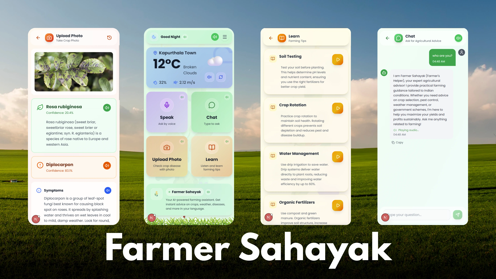

# AI Agricultural Advisor

A multilingual AI advisory system for farmers in India, built with Next.js 14+, featuring voice input, image analysis, and AI-powered agricultural guidance.

## Features

- **11 Indian Languages**: Hindi, Bengali, English, Gujarati, Kannada, Malayalam, Marathi, Odia, Punjabi, Tamil, Telugu
- **No-Login Experience**: Automatic session management with UUID stored in LocalStorage
- **Hybrid Audio Strategy**:
  - Browser native TTS for UI elements (fast & free)
  - Sarvam AI TTS for chat responses (high-quality, natural voice)
- **Multi-Modal Input**:
  - Text input
  - Voice recognition (Web Speech API)
  - Image upload for plant disease detection
- **Weather Integration**: Real-time weather data contextual to farming advice
- **Plant Health Analysis**: AI-powered disease detection using Kindwise API
- **PWA Support**: Installable on mobile devices

## Tech Stack

- **Framework**: Next.js 16.0.10 (App Router)
- **Styling**: Tailwind CSS 4
- **State Management**: Zustand
- **Database**: Neon Postgres + Drizzle ORM
- **AI Services**:
  - Sarvam AI (Chat + TTS)
  - Kindwise (Plant.id & Crop.health)
  - OpenWeather API
- **Speech**: React Speech Recognition
- **Icons**: Lucide React

## Prerequisites

- Node.js 18+ 
- npm or yarn
- API Keys (required):
  - Neon Postgres Database
  - Sarvam AI API Key
  - Kindwise API Keys (Plant.id & Crop.health)
  - OpenWeather API Key

## Setup Instructions

### 1. Clone and Install

```bash
git clone <repository-url>
cd farmer
npm install
```

### 2. Environment Variables

Create a `.env.local` file in the root directory with the following:

```env
# Database (Neon Postgres)
DATABASE_URL="postgresql://..."
POSTGRES_URL="postgresql://..."
POSTGRES_URL_NON_POOLING="postgresql://..."

# API Keys
SARVAM_API_KEY="your_sarvam_api_key"
PLANT_ID_API_KEY="your_plant_id_api_key"
CROP_HEALTH_API_KEY="your_crop_health_api_key"
OPENWEATHER_API_KEY="your_openweather_api_key"

# Optional
NEXT_PUBLIC_APP_URL="http://localhost:3000"
```

### 3. Database Setup

Push the schema to your Neon database:

```bash
npm run db:push
```

### 4. Development

Run the development server:

```bash
npm run dev
```

Open [http://localhost:3000](http://localhost:3000) in your browser.

### 5. Build for Production

```bash
npm run build
npm start
```

## Project Structure

```
farmer/
├── actions/          # Server Actions (API integrations)
│   ├── weather.ts
│   ├── analyze-image.ts
│   ├── sarvam-chat.ts
│   └── sarvam-tts.ts
├── app/              # Next.js App Router
│   ├── layout.tsx
│   ├── page.tsx
│   └── globals.css
├── components/       # React Components
│   ├── Chat/
│   │   ├── ChatInterface.tsx
│   │   ├── MessageBubble.tsx
│   │   └── InputArea.tsx
│   ├── ui/
│   │   └── SpeakingButton.tsx
│   ├── LanguageSelector.tsx
│   └── WeatherWidget.tsx
├── drizzle/          # Database Schema
│   └── schema.ts
├── hooks/            # Custom React Hooks
│   └── useChat.ts
├── lib/              # Utilities
│   ├── audio.ts
│   ├── db.ts
│   └── languages.ts
├── store/            # Zustand State
│   └── useStore.ts
└── public/           # Static Assets
    └── manifest.json
```

## Key Features Implementation

### Hybrid Audio Strategy

**UI Elements** (Weather, Buttons):
```typescript
import { speakNative } from "@/lib/audio";
speakNative("Hello farmer", "hi-IN");
```

**AI Chat Responses**:
- Text generated by Sarvam Chat API
- Audio generated by Sarvam TTS API
- Stored as base64 and auto-played in MessageBubble

### Voice Input

Uses `react-speech-recognition` with browser's native Web Speech API:
```typescript
const { transcript, listening } = useSpeechRecognition();
SpeechRecognition.startListening({ language: "hi-IN" });
```

### Image Analysis

Upload plant images for disease detection:
- Processed by Kindwise Plant.id or Crop.health API
- Results include disease name, probability, treatment, symptoms

### Weather Context

Fetches local weather and includes in LLM prompt for contextual advice.

## API Documentation

- **Sarvam AI**: See `sarvam.md`
- **Kindwise**: See `kindwise.md`

## Database Schema

**chats** table:
- id (UUID)
- session_id (Text)
- role (user | assistant)
- content (Text)
- audio_base64 (Text, optional)
- image_url (Text, optional)
- timestamp (Timestamp)

**user_settings** table:
- session_id (Text, PK)
- language (Text)
- lat (Text)
- lon (Text)

## Scripts

```bash
npm run dev          # Development server
npm run build        # Production build
npm run start        # Production server
npm run lint         # ESLint
npm run db:push      # Push schema to database
npm run db:studio    # Open Drizzle Studio
```

## Deployment

### Vercel (Recommended)

1. Connect your repository to Vercel
2. Add environment variables in Vercel dashboard
3. Deploy

### Other Platforms

The app can be deployed to any platform that supports Next.js:
- Netlify
- AWS Amplify
- Railway
- Render

## Browser Support

- Chrome/Edge: Full support (recommended)
- Firefox: Full support
- Safari: Limited speech recognition support
- Mobile browsers: Install as PWA for best experience

## Troubleshooting

### Speech Recognition Not Working
- Ensure you're using HTTPS (required for microphone access)
- Check browser compatibility
- Grant microphone permissions

### API Errors
- Verify all API keys in `.env.local`
- Check API rate limits
- Ensure database connection string is correct

### Build Errors
- Clear `.next` folder: `rm -rf .next`
- Reinstall dependencies: `npm install`
- Check Node.js version (18+)

## License

MIT

## Contributors

Built with ❤️ for Indian farmers
